# Architecture Serveur MCP - RFP Analyzer

**Version**: 1.0
**Date**: 2025-12-29

---

## 🏗️ Vue d'Ensemble

```mermaid
graph TB
    subgraph "Client MCP (Claude / Desktop)"
        CLIENT[Client MCP]
    end

    subgraph "Serveur MCP - Next.js 14"
        ROUTE[/api/mcp/[transport]]
        AUTH[Auth Middleware]

        subgraph "Resources (Lecture)"
            RES_RFP[rfp://]
            RES_REQ[requirements://]
            RES_SUP[suppliers://]
            RES_RESP[responses://]
        end

        subgraph "Tools (Actions)"
            TOOL_SCORES[get_requirements_scores]
            TOOL_MATRIX[get_scores_matrix]
            TOOL_RFP[get_rfp_with_responses]
            TOOL_COMPARE[compare_suppliers]
            TOOL_EXPORT[export_*]
        end

        subgraph "Utilitaires"
            CALC[Score Calculator]
            TREE[Requirements Tree Builder]
            QUERY[Query Builder]
        end
    end

    subgraph "Data Layer"
        SUPABASE[(Supabase PostgreSQL)]
        RLS[Row Level Security]
    end

    CLIENT -->|MCP Protocol| ROUTE
    ROUTE --> AUTH
    AUTH -->|Validate PAT| SUPABASE

    AUTH --> RES_RFP
    AUTH --> RES_REQ
    AUTH --> RES_SUP
    AUTH --> RES_RESP

    AUTH --> TOOL_SCORES
    AUTH --> TOOL_MATRIX
    AUTH --> TOOL_RFP
    AUTH --> TOOL_COMPARE
    AUTH --> TOOL_EXPORT

    RES_RFP --> QUERY
    RES_REQ --> TREE
    RES_REQ --> CALC

    TOOL_SCORES --> CALC
    TOOL_MATRIX --> CALC

    QUERY --> SUPABASE
    TREE --> SUPABASE
    CALC --> SUPABASE

    SUPABASE --> RLS
```

---

## 🔐 Flux d'Authentification

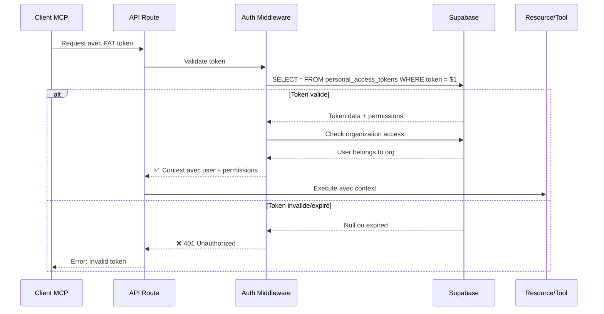

---

## 📦 Architecture des Resources

### Principe
Les Resources exposent des données en lecture seule via URIs.

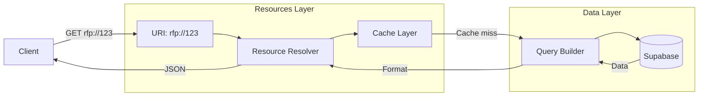

### Exemple de Resource

```typescript
// resources/rfps.ts
server.resource(
  "rfp://{rfp_id}",
  async ({ rfp_id }, { context }) => {
    // 1. Vérifier permissions
    checkPermissions(context, ['requirements:read']);

    // 2. Query Supabase
    const rfp = await supabase
      .from('rfps')
      .select(`
        *,
        requirements(count),
        suppliers(count)
      `)
      .eq('id', rfp_id)
      .eq('organization_id', context.organizationId)
      .single();

    // 3. Formater et retourner
    return {
      uri: `rfp://${rfp_id}`,
      mimeType: 'application/json',
      content: JSON.stringify(formatRFP(rfp))
    };
  }
);
```

---

## 🔧 Architecture des Tools

### Principe
Les Tools exécutent des actions et retournent des résultats structurés.

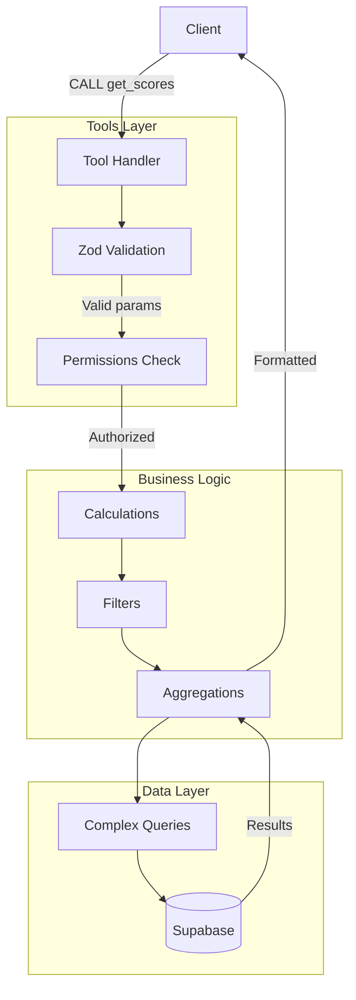

### Exemple de Tool

```typescript
// tools/scoring/get-requirements-scores.ts
server.tool(
  "get_requirements_scores",
  {
    // Schéma Zod
    rfp_id: z.string().uuid(),
    filters: z.object({
      domain_names: z.array(z.string()).optional()
    }).optional()
  },
  async ({ rfp_id, filters }, { context }) => {
    // 1. Validate permissions
    await checkPermissions(context, ['responses:read', 'requirements:read']);

    // 2. Query data
    const requirements = await getRequirementsWithResponses(rfp_id, filters);

    // 3. Calculate scores
    const withScores = requirements.map(req => ({
      ...req,
      statistics: calculateScoreStats(req.responses)
    }));

    // 4. Return structured result
    return {
      rfp_id,
      requirements: withScores,
      global_statistics: calculateGlobalStats(withScores)
    };
  }
);
```

---

## 🧮 Système de Calcul de Scores

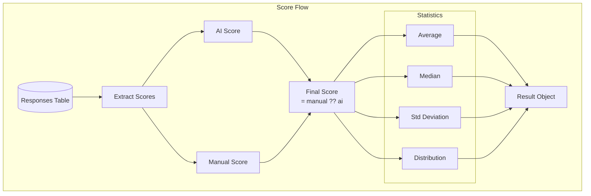

### Logique de Score Final

```typescript
// Pour chaque réponse
response.final_score = response.manual_score ?? response.ai_score

// Statistiques sur un ensemble de réponses
const scores = responses.map(r => r.final_score).filter(s => s !== null);

statistics = {
  avg_score: mean(scores),
  median_score: median(scores),
  min_score: min(scores),
  max_score: max(scores),
  std_deviation: stdDev(scores),
  scores_distribution: countBy(scores),
  best_supplier: maxBy(responses, 'final_score').supplier_name,
  worst_supplier: minBy(responses, 'final_score').supplier_name
}
```

---

## 🌲 Construction de l'Arbre des Exigences

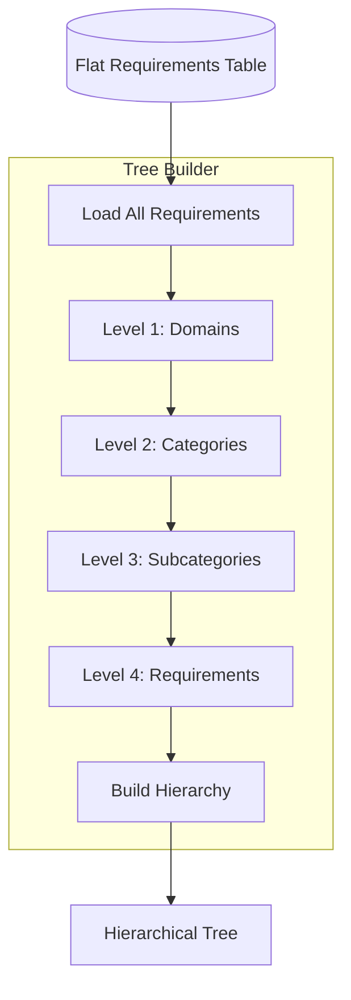

### Algorithme

```typescript
function buildRequirementsTree(requirements: Requirement[]): RequirementNode[] {
  // 1. Grouper par niveau
  const byLevel = groupBy(requirements, 'level');

  // 2. Créer un map pour accès rapide
  const nodeMap = new Map<string, RequirementNode>();
  requirements.forEach(req => {
    nodeMap.set(req.id, { ...req, children: [] });
  });

  // 3. Construire les relations parent-enfant
  requirements.forEach(req => {
    if (req.parent_id) {
      const parent = nodeMap.get(req.parent_id);
      const node = nodeMap.get(req.id);
      if (parent && node) {
        parent.children.push(node);
      }
    }
  });

  // 4. Retourner les racines (level 1)
  return byLevel[1].map(r => nodeMap.get(r.id)!);
}
```

---

## 🔍 Système de Filtrage

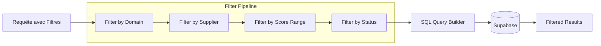

### Query Builder

```typescript
class QueryBuilder {
  private query: any;

  constructor(table: string) {
    this.query = supabase.from(table);
  }

  filterByDomain(domainNames?: string[]) {
    if (domainNames?.length) {
      this.query = this.query.in('domain_name', domainNames);
    }
    return this;
  }

  filterBySuppliers(supplierIds?: string[]) {
    if (supplierIds?.length) {
      this.query = this.query.in('supplier_id', supplierIds);
    }
    return this;
  }

  filterByScoreRange(min?: number, max?: number) {
    if (min !== undefined) {
      this.query = this.query.gte('final_score', min);
    }
    if (max !== undefined) {
      this.query = this.query.lte('final_score', max);
    }
    return this;
  }

  async execute() {
    const { data, error } = await this.query;
    if (error) throw error;
    return data;
  }
}

// Usage
const results = await new QueryBuilder('responses')
  .filterByDomain(['Sécurité'])
  .filterBySuppliers([uuid1, uuid2])
  .filterByScoreRange(4, 5)
  .execute();
```

---

## 📊 Architecture de Comparaison

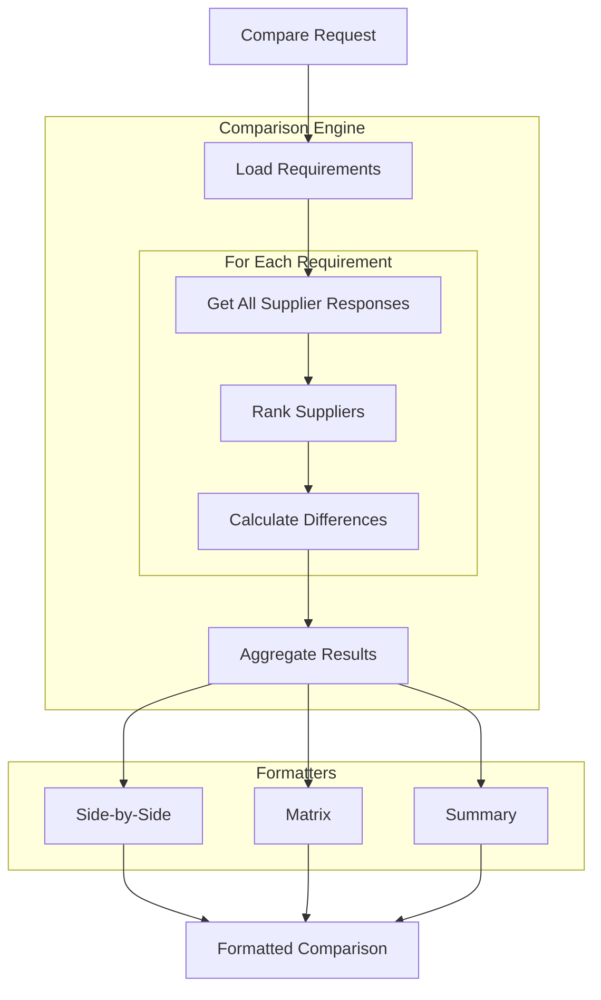

---

## 🔐 Modèle de Sécurité Multi-Tenant

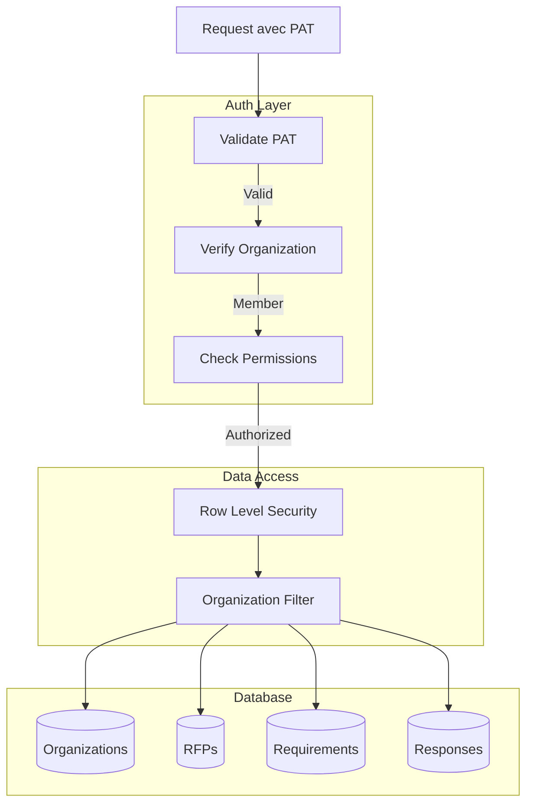

### RLS Policy Example

```sql
-- Policy sur la table responses
CREATE POLICY "Users can only access their organization's responses"
ON responses
FOR SELECT
USING (
  requirement_id IN (
    SELECT r.id
    FROM requirements r
    JOIN rfps rf ON r.rfp_id = rf.id
    JOIN user_organizations uo ON uo.organization_id = rf.organization_id
    WHERE uo.user_id = auth.uid()
  )
);
```

---

## 📈 Monitoring et Observabilité

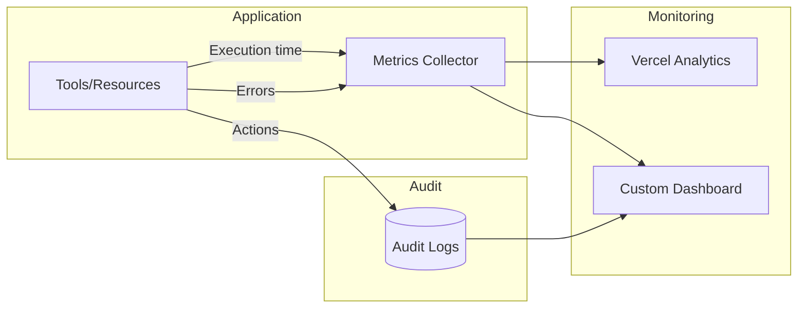

### Métriques Collectées

- **Latence**: Temps de réponse par tool/resource
- **Erreurs**: Taux d'erreur par endpoint
- **Usage**: Nombre d'appels par organization/user
- **Performance**: Query execution time
- **Security**: Failed auth attempts, permission denials

---

## 🚀 Déploiement Vercel

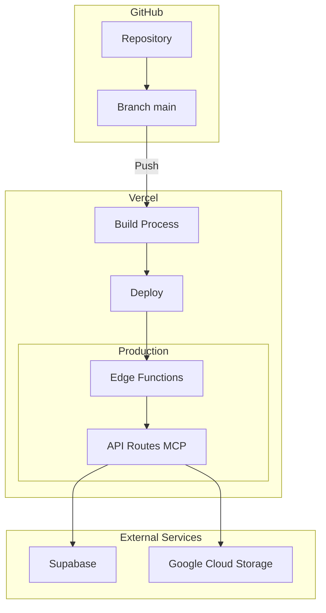

### Environment Variables

```env
# Supabase
NEXT_PUBLIC_SUPABASE_URL=https://xxx.supabase.co
NEXT_PUBLIC_SUPABASE_ANON_KEY=xxx
SUPABASE_SERVICE_ROLE_KEY=xxx  # Server-side only

# Application
NODE_ENV=production
NEXT_PUBLIC_APP_URL=https://mcp.rfp-analyzer.com

# Optional: MCP specific
MCP_API_SECRET=xxx
```

---

## 🧪 Architecture de Test

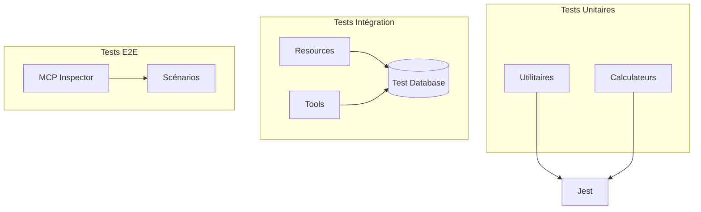

---

## 📚 Références

- [SPECS.md](./SPECS.md) - Spécifications complètes
- [FEATURES_SUMMARY.md](./FEATURES_SUMMARY.md) - Résumé fonctionnalités
- [IMPLEMENTATION_PLAN.md](./IMPLEMENTATION_PLAN.md) - Plan d'implémentation
- [MCP Protocol](https://modelcontextprotocol.io) - Documentation officielle MCP

---

**Dernière mise à jour**: 2025-12-29
