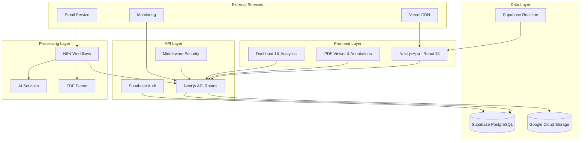
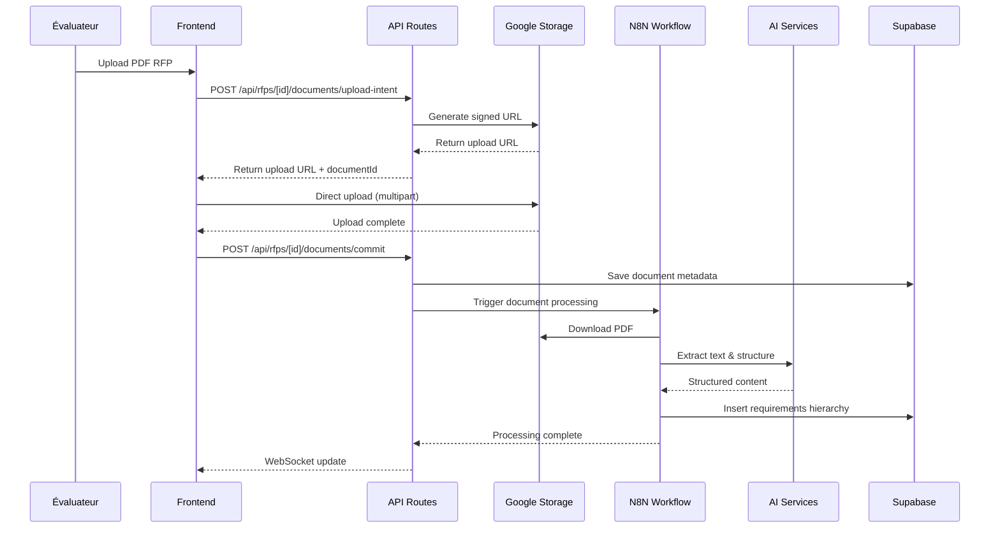
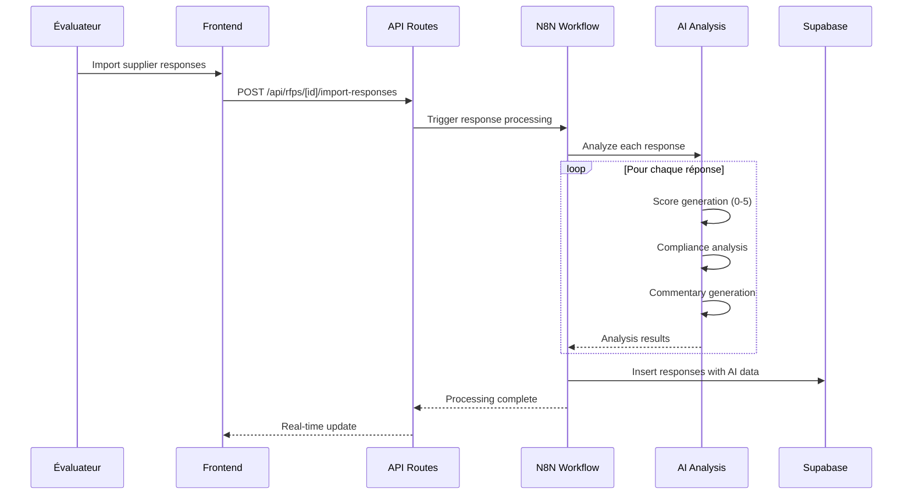
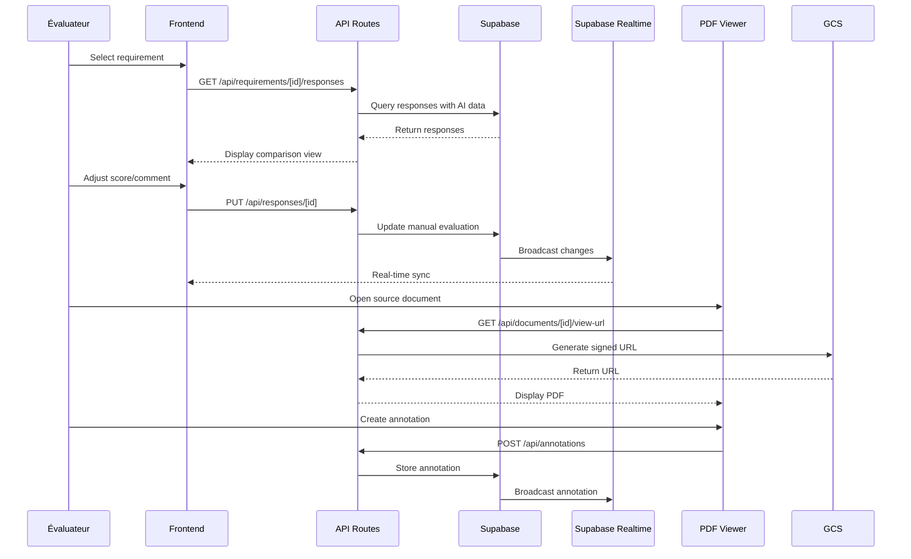
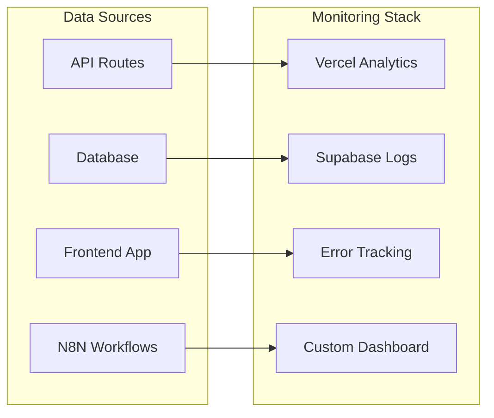
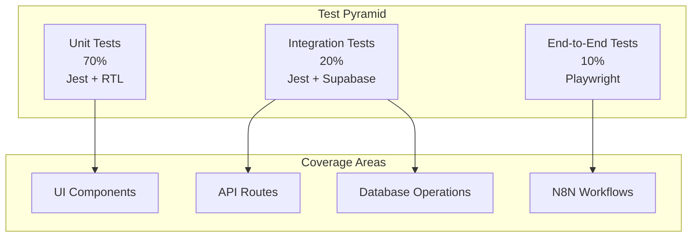

# Architecture & Workflow Guide - RFP Analyzer Platform

**Version**: 1.0  
**Date**: 2025-11-22  
**Auteur**: Generated by OpenCode Agent  
**Scope**: Vue d'ensemble complète du système RFP Analyzer

---

## 🎯 Vue d'ensemble

Le RFP Analyzer est une plateforme SaaS B2B qui permet aux entreprises d'analyser et de comparer les réponses des fournisseurs aux appels d'offres (RFP - Request for Proposal). La plateforme combine traitement automatisé des documents, analyse IA, et évaluation humaine pour optimiser le processus de sélection des fournisseurs.

### Proposition de valeur

1. **Automatisation** : Extraction automatique des exigences et analyse IA des réponses
2. **Collaboration** : Équipes d'évaluation multi-utilisateurs avec rôles et permissions
3. **Traçabilité** : Historique complet des décisions et annotations documentaires
4. **Efficiency** : Réduction de 70% du temps d'évaluation par rapport aux méthodes manuelles

---

## 🏗️ Architecture système

### High-level architecture



### Stack technique détaillé

| Composant          | Technologie          | Version  | Rôle                              |
| ------------------ | -------------------- | -------- | --------------------------------- |
| **Frontend**       | Next.js              | 14.x     | Framework React avec App Router   |
|                    | React                | 18.x     | Bibliothèque UI                   |
|                    | TypeScript           | 5.x      | Typage statique                   |
|                    | Tailwind CSS         | 3.x      | Styling                           |
|                    | shadcn/ui            | Latest   | Composants UI                     |
|                    | react-pdf            | 7.x      | Visualisation PDF                 |
| **Backend**        | Next.js API Routes   | 14.x     | API REST                          |
|                    | Supabase             | Latest   | BaaS (Database + Auth + Realtime) |
|                    | PostgreSQL           | 15+      | Base de données                   |
| **Storage**        | Google Cloud Storage | -        | Stockage fichiers PDF             |
| **Processing**     | N8N                  | Latest   | Workflow automation               |
|                    | PDF.js               | Latest   | Parsing PDF                       |
|                    | AI Services          | Multiple | Analyse textuelle                 |
| **Infrastructure** | Vercel               | -        | Hosting frontend/API              |
|                    | Supabase Cloud       | -        | Hosting database                  |
|                    | GCP                  | -        | Storage et AI services            |

---

## 🔄 Workflow de traitement complet

### Phase 1 : Import et préparation des documents



#### Étapes détaillées

1. **Upload du PDF**
   - Upload direct vers GCS via signed URL (bypass Vercel limits)
   - Métadonnées stockées dans `rfp_documents`
   - Trigger webhook N8N pour traitement

2. **Extraction et structuration (N8N)**
   - Parsing PDF avec PDF.js
   - Extraction de la hiérarchie des exigences
   - Identification des sections et catégories
   - Génération des IDs uniques (REQ-001, CAT-1.1, etc.)

3. **Stockage en base de données**
   - Hiérarchie 4 niveaux : Domain → Category → Subcategory → Requirement
   - Pondération automatique basée sur la structure
   - Contexte et description préservés

### Phase 2 : Import et analyse des réponses fournisseurs



#### Processus d'analyse IA

1. **Parsing des réponses**
   - Extraction du texte de chaque réponse
   - Association avec la bonne exigence
   - Nettoyage et normalisation

2. **Analyse sémantique**
   - Score de compliance (0-5) basé sur :
     - Couverture des exigences
     - Clarté et précision
     - Conformité technique
   - Génération de commentaire explicatif

3. **Classification**
   - Status : Pass/Partial/Fail/Pending
   - Identification des points forts/faibles
   - Détection des ambiguïtés

### Phase 3 : Évaluation humaine collaborative



---

## 📊 Modèle de données détaillé

### Entités principales

```sql
-- Organizations (Multi-tenant)
CREATE TABLE organizations (
    id UUID PRIMARY KEY DEFAULT gen_random_uuid(),
    name VARCHAR(255) NOT NULL,
    slug VARCHAR(100) UNIQUE NOT NULL,
    organization_code VARCHAR(10) UNIQUE NOT NULL,
    subscription_tier VARCHAR(20) DEFAULT 'free',
    max_users INTEGER DEFAULT 10,
    max_rfps INTEGER DEFAULT 5,
    created_at TIMESTAMP DEFAULT NOW(),
    updated_at TIMESTAMP DEFAULT NOW()
);

-- RFP Container
CREATE TABLE rfps (
    id UUID PRIMARY KEY DEFAULT gen_random_uuid(),
    organization_id UUID REFERENCES organizations(id),
    title VARCHAR(255) NOT NULL,
    description TEXT,
    status VARCHAR(20) DEFAULT 'draft',
    created_by UUID REFERENCES auth.users(id),
    created_at TIMESTAMP DEFAULT NOW(),
    updated_at TIMESTAMP DEFAULT NOW()
);

-- Requirements Hierarchy
CREATE TABLE requirements (
    id UUID PRIMARY KEY DEFAULT gen_random_uuid(),
    rfp_id UUID REFERENCES rfps(id) ON DELETE CASCADE,
    parent_id UUID REFERENCES requirements(id),
    level INTEGER NOT NULL CHECK (level BETWEEN 1 AND 4),
    code VARCHAR(20) NOT NULL, -- REQ-001, CAT-1.1, etc.
    title VARCHAR(255) NOT NULL,
    description TEXT,
    context TEXT,
    weight DECIMAL(3,2) DEFAULT 1.0,
    sort_order INTEGER,
    created_at TIMESTAMP DEFAULT NOW()
);

-- Suppliers
CREATE TABLE suppliers (
    id UUID PRIMARY KEY DEFAULT gen_random_uuid(),
    rfp_id UUID REFERENCES rfps(id) ON DELETE CASCADE,
    name VARCHAR(255) NOT NULL,
    contact_info JSONB,
    created_at TIMESTAMP DEFAULT NOW()
);

-- Responses (core evaluation data)
CREATE TABLE responses (
    id UUID PRIMARY KEY DEFAULT gen_random_uuid(),
    requirement_id UUID REFERENCES requirements(id) ON DELETE CASCADE,
    supplier_id UUID REFERENCES suppliers(id) ON DELETE CASCADE,
    response_text TEXT NOT NULL,

    -- AI Analysis
    ai_score INTEGER CHECK (ai_score BETWEEN 0 AND 5),
    ai_comment TEXT,
    ai_confidence DECIMAL(3,2),

    -- Manual Evaluation
    manual_score INTEGER CHECK (manual_score BETWEEN 0 AND 5),
    manual_comment TEXT,
    questions_doubts TEXT,
    status VARCHAR(20) DEFAULT 'pending',
    is_completed BOOLEAN DEFAULT FALSE,

    -- Metadata
    evaluated_by UUID REFERENCES auth.users(id),
    evaluated_at TIMESTAMP,
    created_at TIMESTAMP DEFAULT NOW(),
    updated_at TIMESTAMP DEFAULT NOW(),

    UNIQUE(requirement_id, supplier_id)
);

-- PDF Documents
CREATE TABLE rfp_documents (
    id UUID PRIMARY KEY DEFAULT gen_random_uuid(),
    rfp_id UUID REFERENCES rfps(id) ON DELETE CASCADE,
    organization_id UUID REFERENCES organizations(id),
    filename VARCHAR(255) NOT NULL,
    original_filename VARCHAR(255) NOT NULL,
    document_type VARCHAR(50),
    mime_type VARCHAR(50),
    file_size BIGINT,
    gcs_object_name TEXT NOT NULL,
    page_count INTEGER,
    created_by UUID REFERENCES auth.users(id),
    created_at TIMESTAMP DEFAULT NOW(),
    updated_at TIMESTAMP DEFAULT NOW(),
    deleted_at TIMESTAMP
);

-- PDF Annotations
CREATE TABLE pdf_annotations (
    id UUID PRIMARY KEY DEFAULT gen_random_uuid(),
    organization_id UUID REFERENCES organizations(id),
    document_id UUID REFERENCES rfp_documents(id) ON DELETE CASCADE,
    requirement_id UUID REFERENCES requirements(id),
    supplier_id UUID REFERENCES suppliers(id),

    annotation_type VARCHAR(20) NOT NULL, -- highlight, bookmark, note
    page_number INTEGER NOT NULL,
    position JSONB NOT NULL, -- { rects, textRange }
    highlighted_text TEXT,
    note_content TEXT,
    color VARCHAR(7) DEFAULT '#FFEB3B',
    tags TEXT[],

    created_by UUID REFERENCES auth.users(id),
    created_at TIMESTAMP DEFAULT NOW(),
    updated_at TIMESTAMP DEFAULT NOW(),
    deleted_at TIMESTAMP
);
```

### Relations et contraintes

1. **Multi-tenancy** : Toutes les tables ont `organization_id` ou sont liées à une organization
2. **RLS Policies** : Row Level Security pour l'isolation des données
3. **Indexes** : Optimisés pour les requêtes principales
4. **Soft deletes** : `deleted_at` pour conservation des données

---

## 🔐 Sécurité et permissions

### Modèle de permissions

| Rôle       | Organizations | RFPs          | Requirements | Responses | Annotations |
| ---------- | ------------- | ------------- | ------------ | --------- | ----------- |
| **admin**  | CRUD all      | CRUD all      | Read all     | CRUD all  | CRUD all    |
| **member** | Read own      | CRUD assigned | Read all     | CRUD all  | CRUD all    |
| **viewer** | Read own      | Read assigned | Read all     | Read only | Read only   |

### RLS Policies (Row Level Security)

```sql
-- Example: Organizations table
CREATE POLICY "Users can view their organizations" ON organizations
    FOR SELECT USING (
        id IN (
            SELECT organization_id
            FROM user_organizations
            WHERE user_id = auth.uid()
        )
    );

-- Example: Responses table
CREATE POLICY "Users can view responses of their RFPs" ON responses
    FOR SELECT USING (
        requirement_id IN (
            SELECT r.id
            FROM requirements r
            JOIN rfps rf ON r.rfp_id = rf.id
            WHERE rf.organization_id IN (
                SELECT organization_id
                FROM user_organizations
                WHERE user_id = auth.uid()
            )
        )
    );
```

### Sécurité des fichiers

1. **Signed URLs** : URLs d'accès aux PDFs expirant après 90 secondes
2. **GCS Permissions** : Accès restreint via service accounts
3. **Audit Trail** : Toutes les accès aux fichiers sont loggués

---

## 🚀 Déploiement et infrastructure

### Environnements

| Environnement   | Usage               | Hosting           | Domaine                  |
| --------------- | ------------------- | ----------------- | ------------------------ |
| **Development** | Dev local & testing | Vercel + Supabase | dev.rfp-analyzer.com     |
| **Staging**     | Pre-production      | Vercel + Supabase | staging.rfp-analyzer.com |
| **Production**  | Live service        | Vercel + Supabase | app.rfp-analyzer.com     |

### Configuration requise

#### Environment Variables

```env
# Supabase Configuration
NEXT_PUBLIC_SUPABASE_URL=https://your-project.supabase.co
NEXT_PUBLIC_SUPABASE_ANON_KEY=your-anon-key
SUPABASE_SERVICE_ROLE_KEY=your-service-role-key

# Google Cloud Storage
GCP_PROJECT_ID=rfp-analyzer-project
GCS_BUCKET=rfp-analyzer-storage
GCP_SA_KEY_JSON={"type":"service_account",...}

# N8N Integration
N8N_WEBHOOK_URL=https://your-n8n-instance.com/webhook
N8N_API_KEY=your-n8n-api-key

# Application
NEXTAUTH_URL=https://app.rfp-analyzer.com
NEXTAUTH_SECRET=your-nextauth-secret
```

#### Services externes

1. **Vercel** : Frontend + API routes
2. **Supabase** : Database + Auth + Realtime
3. **Google Cloud Storage** : File storage
4. **N8N** : Workflow automation (self-hosted)
5. **AI Services** : OpenAI/Claude/Anthropic (via N8N)

---

## 📈 Monitoring et observabilité

### Métriques clés

#### Application Performance

- **Response time** : < 2s pour 95% des requêtes
- **Uptime** : > 99.9%
- **Error rate** : < 0.1%
- **Database performance** : < 100ms query time

#### Business Metrics

- **RFP processing time** : < 5 minutes par document
- **AI analysis accuracy** : > 85% satisfaction
- **User engagement** : Sessions par jour/utilisateur
- **Feature adoption** : % utilisant annotations, collaboration

### Stack de monitoring



---

## 🔄 Workflows N8N détaillés

### Workflow 1 : Document Processing

```yaml
name: "RFP Document Processing"
trigger:
  type: webhook
  path: /process-document

nodes:
  - name: "Download PDF"
    type: HTTP Request
    parameters:
      url: "{{$node.Webhook.body.json.documentUrl}}"
      responseFormat: file

  - name: "Extract Text"
    type: PDF Extract
    parameters:
      preserveLayout: true
      extractImages: false

  - name: "Structure Requirements"
    type: AI Text Analysis
    parameters:
      model: "gpt-4"
      prompt: |
        Analyze this RFP document and extract:
        1. Hierarchical requirements (4 levels max)
        2. Categories and subcategories
        3. Weight/importance indicators
        4. Context and descriptions

        Format as JSON with structure:
        {
          "domains": [
            {
              "title": "Domain Name",
              "categories": [...]
            }
          ]
        }

  - name: "Save to Database"
    type: HTTP Request
    parameters:
      url: "{{$env.API_URL}}/api/requirements/import"
      method: POST
      body: "{{$node.Structure_Requirements.json}}"

  - name: "Notify Completion"
    type: HTTP Request
    parameters:
      url: "{{$env.API_URL}}/api/webhooks/document-processed"
      method: POST
```

### Workflow 2 : Response Analysis

```yaml
name: "Supplier Response Analysis"
trigger:
  type: webhook
  path: /analyze-responses

nodes:
  - name: "Get Responses"
    type: HTTP Request
    parameters:
      url: "{{$env.API_URL}}/api/responses/pending-analysis"

  - name: "Analyze Each Response"
    type: Split In Batches
    batchSize: 5

  - name: "AI Analysis"
    type: AI Text Analysis
    parameters:
      model: "gpt-4"
      prompt: |
        Analyze this supplier response against the requirement:

        Requirement: {{$node.Requirement.data.title}}
        Description: {{$node.Requirement.data.description}}

        Response: {{$node.Response.data.response_text}}

        Provide:
        1. Score (0-5) with justification
        2. Compliance status (pass/partial/fail)
        3. Strengths and weaknesses
        4. Specific concerns or questions

        Format as JSON.

  - name: "Update Response"
    type: HTTP Request
    parameters:
      url: "{{$env.API_URL}}/api/responses/{{$node.Response.data.id}}"
      method: PUT
      body: |
        {
          "ai_score": {{$node.AI_Analysis.json.score}},
          "ai_comment": {{$node.AI_Analysis.json.commentary}},
          "status": {{$node.AI_Analysis.json.status}}
        }

  - name: "Continue Batch"
    type: Continue
```

---

## 🧪 Stratégie de test

### Pyramide de test



### Cas de test critiques

#### 1. Workflow complet RFP

- Upload PDF → Processing → Requirements extraction → Response import → Evaluation

#### 2. Collaboration multi-utilisateurs

- Deux évaluateurs travaillant sur le même RFP
- Mise à jour temps réel des annotations
- Gestion des conflits (last-write-wins)

#### 3. Performance avec gros volumes

- 200+ exigences
- 10 fournisseurs
- Documents PDF de 50+ pages

#### 4. Sécurité multi-tenant

- Isolation des données entre organizations
- Permissions par rôle
- Accès non autorisé

---

## 📋 Glossaire

| Terme            | Définition                            | Exemple                                                         |
| ---------------- | ------------------------------------- | --------------------------------------------------------------- |
| **RFP**          | Request for Proposal - Appel d'offres | Document client avec exigences techniques                       |
| **Requirement**  | Exigence évaluable                    | "Le système doit supporter 1000 utilisateurs concurrents"       |
| **Response**     | Réponse fournisseur à une exigence    | "Notre solution supporte 5000 utilisateurs via load balancing"  |
| **AI Score**     | Score généré par l'IA (0-5)           | 4/5 - "Bonne couverture avec quelques limitations"              |
| **Manual Score** | Score ajusté par l'évaluateur         | 5/5 - "Après vérification technique, la réponse est excellente" |
| **Annotation**   | Note ou surlignage sur document PDF   | Surlignage d'une clause contractuelle importante                |
| **Organization** | Entreprise ou business unit client    | "Acme Corporation - IT Department"                              |
| **Tenant**       | Instance isolée de données            | Chaque organization = un tenant                                 |

---

## 🚀 Feuille de route technique

### Phase 1 : Foundation (Q1 2025)

- ✅ Architecture de base
- ✅ Authentification et multi-tenancy
- ✅ Upload et traitement PDF
- ✅ Interface d'évaluation de base

### Phase 2 : Collaboration (Q2 2025)

- 🔄 Annotations PDF avancées
- 🔄 Temps réel multi-utilisateurs
- 🔄 Workflow de validation
- 🔄 Export et rapports

### Phase 3 : Intelligence (Q3 2025)

- 📋 Analyse IA avancée
- 📋 Prédictions de performance
- 📋 Recommandations
- 📋 Benchmarking

### Phase 4 : Scale (Q4 2025)

- 📋 Architecture microservices
- 📋 Analytics avancés
- 📋 API publique
- 📋 Marketplace d'intégrations

---

## 📞 Support et maintenance

### Niveaux de support

| Niveau            | Scope               | Response time | Escalation |
| ----------------- | ------------------- | ------------- | ---------- |
| **P1 - Critical** | Production down     | < 1 heure     | Immédiat   |
| **P2 - High**     | Feature broken      | < 4 heures    | 24h        |
| **P3 - Medium**   | Performance issue   | < 24 heures   | 48h        |
| **P4 - Low**      | Enhancement request | < 72 heures   | 1 semaine  |

### Processus de déploiement

1. **Development** : Feature branches → PR → Review
2. **Staging** : Auto-deploy sur merge vers main
3. **Production** : Déploiement manuel après validation
4. **Rollback** : Possibilité de retour à la version précédente

---

## 📚 Références

- [Spécifications détaillées](../001-rfp-analyzer-platform/spec.md)
- [Documentation PDF Upload](../002-upload-PDF/)
- [Guide de développement](../001-rfp-analyzer-platform/quickstart.md)
- [API Documentation](../001-rfp-analyzer-platform/contracts/api.yaml)

---

_Ce document est maintenu par l'équipe technique RFP Analyzer et mis à jour à chaque évolution majeure de l'architecture._
